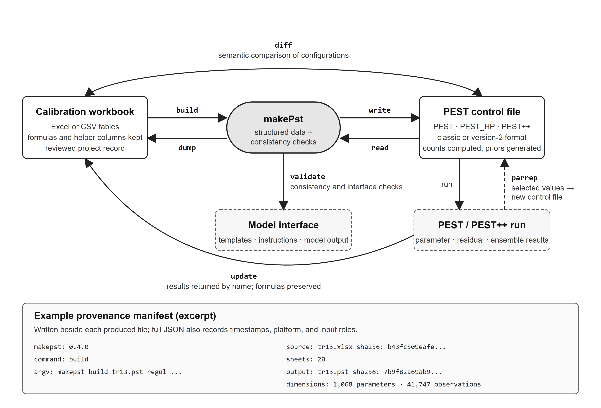

# makePst: A Reproducible and Auditable Spreadsheet Workflow for PEST Model Calibration

**Gengxin Ou** (corresponding author; mou@sspa.com), **Zhaowei Wang** (JWang@sspa.com)
S.S. Papadopulos & Associates, Inc.; 1801 Rockville Pike, Suite 220, Rockville, MD 20852

---

## The problem: two representations of one calibration

Parameter estimation with the PEST family of software — PEST (Doherty 2015), PEST_HP (Doherty 2020), and PEST++ (White et al. 2020) — is routine in groundwater modeling. Every PEST run is defined by a control file: a text document defining parameters and their bounds, observations and their weights, parameter and observation groups, prior information, the model command, and the template and instruction files that connect PEST to the model. For a highly parameterized model this file runs to tens of thousands of lines. PEST++ can hold the tabular sections in external CSV files instead (`pcf version=2`), which moves the tables out of the control file but leaves the same content to prepare and keep consistent.

For such applications, control files are rarely practical to maintain manually, and in many consulting workflows the working calibration record is instead kept in spreadsheets. A workbook can bring parameter definitions, observation values, source references, weighting formulas, and PEST/PEST++ settings into one reviewable record. Sheets can separate parameter types and observation sources, while helper columns retain model layer or pilot-point indices, native values, and notes on data selection. Formulas can balance observation groups, down-weight a period of record, or scale a parameter bound from a native value. This organization lets colleagues review the calibration inputs alongside the assumptions used to prepare them; the control file is derived from that record.

Two families of tools currently support these operations — constructing the control file, checking it, adjusting weights, and returning results. The PEST distribution provides single-purpose command-line utilities (PESTCHEK, TEMPCHEK, INSCHEK, PARREP, PWTADJ) that operate only on PEST's own text files. pyEMU (White et al. 2016) is a Python library for parameterization, control-file construction, ensembles, and uncertainty analysis, and its use requires writing and maintaining scripts. Neither addresses the case of a calibration maintained in a workbook and executed from a batch file, where operations are required without programming.

Deriving the control file from that record — writing the tables PEST expects, with the counts, names, and cross-references it requires — is the step at which errors arise. Counts in the control file must match the tables; parameter groups must be defined before they are used; a tied parameter must point at a parameter that exists and is neither tied nor fixed; a regularization equation must not cite a fixed parameter; every parameter must appear in a template file and every observation in an instruction file. Some inconsistencies prevent a PEST run from starting; others leave a syntactically valid control file whose contents no longer reflect the modeler's intended setup. After a run the transfer is reversed: best parameter values, residuals, and — for PESTPP-IES — a selected realization must be returned to the workbook by name, to the correct rows of the correct sheets, without overwriting the formulas that produced the weights.

A PEST_HP or PESTPP-IES run for a regional transient model occupies a cluster for hours to days. Errors caught at start-up cost little, whereas an internally valid but unintended configuration — a parameter fixed that should have been adjustable, a weight a formula would have set differently, an earlier iteration's values — can consume a complete run before review exposes the problem. Later, when a reviewer asks which workbook produced a given control file, or what changed between two runs that behaved differently, a text comparison of 40,000 lines is not an answer. Three needs follow: to check a configuration before PEST sees it, to compare two configurations by meaning rather than by text, and to record what produced each file.

Development of makePst was motivated by experience with a conversion script used for a regional model through more than a dozen calibration runs: it wrote the control file, but met none of those needs, and results went back into the workbook by hand. What was missing was a layer that treats the spreadsheet as a first-class, bidirectional interface — keeping it and the control file demonstrably consistent, and preserving the user's formulas when results are written back.

The distinguishing feature of makePst is not control-file generation alone, but a bidirectional, command-line workflow in which spreadsheets serve as reviewable calibration records while control-file construction, validation before execution, formula-preserving transfer of results, semantic comparison, and provenance are each a single command requiring no Python code.

## What makePst does

makePst is installed with `pip` and invoked as `makepst <command>`. It provides fifteen self-contained commands (Table 1) that read and write control files and workbooks. Internally the commands share one structured representation of the calibration — tables, control variables, model commands, template and instruction pairs, and PEST++ options — so that the same consistency rules apply in either direction of transfer (Figure 1). A calibration cycle is expressed as a few command lines that a batch file or a continuous-integration job executes unchanged.

```
makepst build model.pst regularisation --set_ctl_xls project.xlsm,CONTROL \
    --add_pargp_xls project.xlsm,PARGP --add_par_xls project.xlsm,PAR_* \
    --add_obs_xls project.xlsm,OBS_* --add_io_xls project.xlsm,IO
makepst validate model.pst
makepst update project.xlsm --par model.par --res model.res --out project_results.xlsm
```

Commands that read a control file also accept a workbook in its place, building it first, so that a configuration can be checked or compared before a control file exists. Commands that produce a file write a sidecar manifest — the command line, input hashes and sheets, and output hash and dimensions, as well as makepst and its dependency versions, which `log` and `provenance` subsequently read. Round-tripping is defined semantically: a control file that is read and written again describes the same calibration but need not match line for line, because whitespace, name capitalization, number formatting, and the order of some entries are written in a standard form rather than preserved.

**Table 1.** The command set. Each command is executed from a command prompt, batch file, or continuous-integration job.

| Command | Operation |
|---|---|
| `init` | write a starter workbook that already builds a valid control file |
| `build` | worksheets or CSV files → PEST / PEST_HP / PEST++ control file |
| `dump` | control file → workbook whose sheets `build` reads back |
| `validate` | PESTCHEK's checks on a control file or workbook, and on the files it references |
| `tempchek`, `inschek` | check template and instruction files; write model inputs, read model outputs |
| `update` | parameter, residual, or PESTPP-IES results → an existing workbook, matched by name |
| `parrep`, `set`, `reweight` | new control file with replaced parameter values, edited parameter fields, or rebalanced observation weights |
| `hpstart` | PEST_HP `.hp` file updated from residuals or a realization |
| `diff` | semantic comparison of two control files, or a control file and a workbook |
| `log`, `provenance` | the manifests of a project folder as a ledger; recorded hashes against the files on disk |
| `bundle` | zip a run with everything its control file references |

Several commands correspond to PEST utilities of the same name or role (TEMPCHEK, INSCHEK, PARREP, PWTADJ, PESTCHEK), allowing an existing batch file to adopt them incrementally. The three commands used most heavily are described below.

**`build`** reads the calibration tables — control variables, parameter groups, parameters, observations, prior information, model input/output pairs, and PEST++ options — and writes a PEST-family control file. Each table is named on the command line, either as a worksheet (`--add_par_xls project.xlsm,PAR_HK`) or, interchangeably, as a CSV file (`--add_par_csv par_hk.csv`). Names are the modeler's own and may be patterns, and one table may span as many worksheets or files as a project requires: eight parameter worksheets, one per parameter type, are read as one parameter table.

Within each table, columns are matched to the field names defined in the PEST manual, for example, `PARNME`, `PARTRANS`, `PARVAL1`, `PARLBND`, `PARUBND`, `PARGP` for parameters, and `OBSNME`, `OBSVAL`, `WEIGHT`, `OBGNME` for observations. Columns that are not PEST fields, such as source references, indices, or notes, are ignored wherever they occur. Two conventions extend the manual's fields: a `TIETO` column ties a parameter to another, and `PRIOR` and `WEIGHT` columns in a parameter table generate regularization equations, so ties and regularization are expressed beside their own parameters rather than in a separate section. Formula-derived fields, including observation weights, are read from the values Excel last calculated; `build` does not evaluate formulas, so a revised weighting formula is transferred to the control file after the workbook has been recalculated and saved. Counts are computed rather than entered, and PEST_HP/PEST++ keywords are supported. `makepst init` writes a starter workbook in a conventional layout, with these headers, defaults, and an example row for each table.

**`validate`** reports without modifying files. Its rules are derived from the source of PESTCHEK — duplicate names, groups, ties, bounds, prior equations, name lengths, control variable values , and the syntax of template and instruction files — and it additionally checks the model command line and the directories into which model input files will be written, resolved relative to the directory in which PEST runs, and optionally applies the instruction files to model output. It accepts a workbook carrying its build command in place of a control file, and `build --dry_run` applies the same report to tables named on the command line, so a configuration can be checked before a control file is written.

**`update`** returns parameter, residual, or PESTPP-IES ensemble results to an existing workbook. It matches rows by name across worksheets and writes only the requested columns of the matched rows; all other cells remain unchanged. Formulas are preserved because each target cell is examined before writing and skipped if it contains a formula, so a weight computed by a formula is counted and reported rather than overwritten. Residual updates also report objective-function contributions by observation group. Two backends are available: openpyxl, which rewrites the file directly and therefore runs on any platform without Excel, and xlwings, which drives an installed copy of Excel through its automation interface on Windows or macOS, preserving charts, images, and macros and recalculating formulas.

**`diff`** compares two configurations by content rather than by text: parameters and observations added, removed, or changed column by column, prior equations, effective control values with defaults applied, and the file pairs, each evaluated within a numeric tolerance. Because a workbook is accepted wherever a control file is, a single command determines whether a control file still corresponds to its source workbook. **`log`** lists the manifests of a project folder as a ledger — date, command, output, and sources — and can be filtered by file name or hash, so that identifying the runs that used a particular version of a workbook is likewise a single command.

## Demonstration on a regional model

The demonstration uses the calibration workbook of a regional transient MODFLOW model; the workbook and the files its control file references are in the repository under `examples/mnnrd/`, and `paper/reproduce.py` regenerates the metrics below. The workbook holds 20 worksheets — eight parameter sheets, one per parameter type, seven observation sheets spanning steady-state and transient heads, head differences, streamflow, stream leakage, and lake stages, and the control, group, input/output, and PEST++ option sheets — with many observation weights computed by formulas that reference the number of records per well and a group-balancing factor.

*Build.* One command produces a 2.6-MB control file of 43,549 lines — 1,068 parameters in 12 groups, 41,747 observations in 12 groups, 159 regularization equations generated from the parameter sheets, 18 template and 7 instruction files — in about ten seconds on a laptop, most of it spent reading Excel. On that file `makepst validate` and `pestchek` report no errors and the same warnings, except that `pestchek` rejects the PEST_HP and PEST++ control variables makePst accepts, and makePst additionally checks that the directory for each model input file exists and that the files named on the model command line are present.

*Round trip.* `dump` writes the control file to a fresh workbook; `build` from that workbook's stored command regenerates the control file; `diff` reports no semantic differences between the original and the rebuilt configuration. For this project the two makePst-generated files were also byte-identical. This tests internal consistency, not whether the original build captured every intended workbook value.

*Results back.* `update` with a parameter file and a residuals file writes values into the eight parameter sheets (1,068 rows matched) and modelled values and residuals into the seven observation sheets (41,747 rows), plus an objective-function sheet, leaving every weight formula untouched. With the xlwings backend, the parameter update of the production workbook itself — 27 worksheets, macros, a chart, and 12,719 formulas on the parameter sheets — completed within seconds; the saved copy kept every worksheet, formula, and macro, and the 1,068 `PARVAL1` values in the rebuilt control file match those in the parameter file.

*Provenance.* Each command above wrote a manifest beside its output, recording the makePst, Python, and dependency versions, the command line as issued, the SHA-256 hash of the workbook together with the 20 sheets read from it, and the hash and dimensions of the file produced (Figure 1). `log` lists those manifests as a project ledger — when, which command, which output, from which sources — and `provenance` rechecks every recorded hash against the files on disk. The question asked in a later review, which workbook produced a given control file, is therefore answered by hash rather than by file name or modification date: a workbook edited after the run no longer matches its recorded hash, and `log --file` retrieves every run that used a particular version of it. For work subject to client or agency review, this is a reproducibility record rather than a file-management convenience.

## Validation, scope, and limitations

The test suite at the submitted version contains 240 tests, two of which need the demonstration workbook and are skipped without it; continuous integration runs the suite on Linux and Windows with Python 3.9, 3.11, and 3.13. Tests include builds from a synthetic workbook compared line by line against a stored reference control file, read–write identity, `dump`-then-`build` equality, multi-sheet workbook updates with formula protection, provenance checks, ensemble selection, validation rules, the instruction interpreter, and the documented tutorial.

makePst reads and writes classic PEST control files, the PEST_HP extensions used in the demonstration, and PEST++ control files in both the classic and the version-2 external-table formats; it reads `.par`, `.res`/`.rei`, and PESTPP-IES ensemble and objective-function files. It does not perform calibration, uncertainty analysis, geostatistical parameterization, or run management. The instruction interpreter behind `validate` follows the manual but is not PEST, and its findings are reported as warnings. Recognized pass-through sections are retained verbatim; unrecognized sections are also retained verbatim, with a warning. `dump` recovers supported control-file content in nine standardized sheets, not the original workbook's organization, formulas, or notes. Excel-faithful updates require Excel and xlwings; the openpyxl backend keeps macros but not charts and does not recalculate formulas, so a workbook it has updated must be opened, recalculated, and saved in Excel before it is built from again — otherwise cached formula values may be missing or stale. `build` warns about missing cached results in referenced fields but cannot determine whether existing cached values are current.

pyEMU provides a broader Python framework for PEST++ interface construction, parameterization, ensembles, geostatistics, and uncertainty analysis (White et al. 2016). pyEMU primarily exposes these capabilities through a Python API, whereas makePst's intended user interface is the command line plus spreadsheets/CSV files. A complementary workflow uses pyEMU for interface construction and analysis, and makePst for reviewing calibration tables, weighting formulas, and control settings together in a workbook. Supported control-file content provides the exchange between the packages, while makePst returns PEST and PEST++ results to the workbook. Interchange is subject to each package's format support; it should not be assumed to preserve every specialized control setting.

## Significance for practice

The practical benefit is that the operations a calibration requires — construction, checking, comparison, reweighting, and the return of results — are available to modelers who do not write Python, in the environment where the model is already run. A weighting factor is revised in the workbook, the recalculated weights are reviewed alongside the observations, and one command rebuilds the control file; a second checks it before cluster time is committed; results are returned by name, with weight formulas protected by default. The reasoning behind a configuration remains adjacent to the values supplied to PEST, and the complete cycle resides in a batch file that any project member can rerun.

The same workflow supports reproducibility. A workbook and its build command can regenerate a configuration, `diff` can check semantic agreement, and manifests record which files produced each output. The workbook centralizes calibration tables and settings; model files, templates, and instruction files remain separate, linked through the input/output mappings. CSV input also supports automated workflows where a spreadsheet interface is unnecessary.

By treating spreadsheets and control files as reproducibly linked representations of the same calibration configuration, makePst lets groundwater modelers retain familiar review practices while making control-file construction, checking, and result transfer efficient and reproducible. It is intended as a small, auditable layer within existing PEST and PEST++ workflows, not a replacement for any part of them.

## Software availability

makePst is available under the MIT License at https://github.com/ougx/makePst. The version described here is 0.4.0 (tagged `v0.4.0`; also on PyPI as `makepst`). The repository contains a four-parameter tutorial (`examples/minimal/`), the regional-model workbook and files used for the demonstration (`examples/mnnrd/`), and the script that regenerates the reported metrics from them (`paper/reproduce.py`).

## Conflict of Interest

The authors are developers of makePst. The software is open source under the MIT License.

## References

Doherty, J. 2015. *Calibration and Uncertainty Analysis for Complex Environmental Models.* Brisbane, Australia: Watermark Numerical Computing.

Doherty, J. 2020. *PEST_HP: PEST for Highly Parallelized Computing Environments.* Brisbane, Australia: Watermark Numerical Computing.

White, J.T., M.N. Fienen, and J.E. Doherty. 2016. A python framework for environmental model uncertainty analysis. *Environmental Modelling & Software* 85: 217–228. https://doi.org/10.1016/j.envsoft.2016.08.017

White, J.T., R.J. Hunt, M.N. Fienen, and J.E. Doherty. 2020. *Approaches to Highly Parameterized Inversion: PEST++ Version 5, a Software Suite for Parameter Estimation, Uncertainty Analysis, Management Optimization and Sensitivity Analysis.* U.S. Geological Survey Techniques and Methods 7-C26. https://doi.org/10.3133/tm7C26

---


**Figure 1.** makePst workflow linking spreadsheet-based project records and PEST-family control files. Calibration definitions are built into and reconstructed from control files through a common structured representation; validation and semantic comparison support QA/QC, while parameter, residual, and ensemble results are returned to existing workbooks by name. The inset is an abbreviated manifest from the demonstration build; complete manifests record software, commands, timestamps, source sheets and hashes, output hashes, and project dimensions. [Figure file: `paper/figure1.svg`, generated by `paper/make_figure1.py`.]
